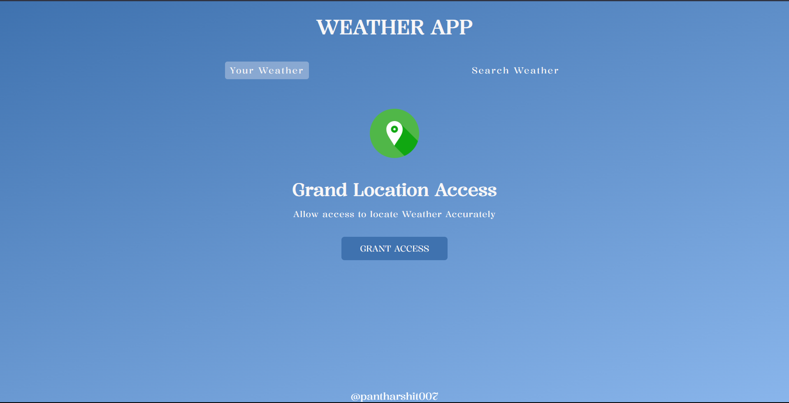
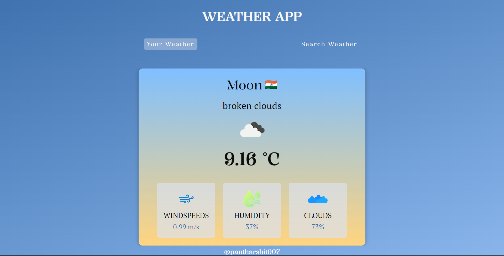
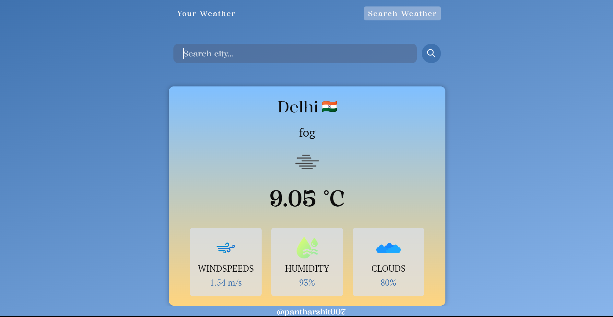

# Weather App

A simple and intuitive weather app that allows users to check their local weather or search for weather information in different cities.

## Table of Contents

- [Introduction](#introduction)
- [Features](#features)
- [Usage](#usage)
- [Screenshots](#screenshots)
- [How to Run](#how-to-run)
- [API Key](#api-key)
- [Contact](#contact)

## Introduction

This Weather App provides users with real-time weather information, including temperature, wind speed, humidity, and more. Users can view their local weather by granting location access or search for weather information in other cities.

## Features

- **User and Search Tabs:** Easily switch between viewing the user's local weather and searching for weather information in other locations.

- **Grant Location Access:** Grant access to accurately locate the user's weather information.

- **Search Form:** Allows users to search for weather information in specific cities.

- **Loading Screen:** Displays a loading screen while fetching weather data.

- **Weather Information Display:** Presents detailed weather information, including city name, country icon, weather description, temperature, wind speed, humidity, and cloudiness.

- **Error Handling:** Informs users if a searched city is not found.

## Usage

1. Open the Weather App.
2. Choose between the "Your Weather" and "Search Weather" tabs.
3. Grant location access or use the search form to find weather information.
4. View real-time weather details for the selected location.

## Screenshots]

*Grant Location.*

*Main weather display with user location.*

*Search form for looking up weather information for other cities.*

## How to Run

To run the Weather App locally, follow these steps:

1. Clone the repository.
2. Open the `index.html` file in your preferred web browser.

## API Key

Make sure to obtain an API key from [OpenWeatherMap](https://openweathermap.org/api) and replace the placeholder in the `APIKEY.js` file.

## Contact

For issues, questions, or feedback, feel free to reach out.

## धन्यवाद (Thank You)!

---